# DroidLibs

DroidLibs is an Android Library consisting of several tools and ready to use UI components that ease in the development of modern Android apps. This library consists of multiple modules. You can selectively add the modules as your project's dependencies based on your needs.

# Setup

1. Add `Jitpack` to your `setting.gradle.kts` :
   
   ```kotlin
   dependencyResolutionManagement {
       repositoriesMode.set(RepositoriesMode.FAIL_ON_PROJECT_REPOS)
       repositories {
           google()
           mavenCentral()
           maven("https://jitpack.io") // <- Add this
       }
   }
   ```

2. Add dependencies of required modules in your `build.gradle.kts` :
   
   [](https://jitpack.io/#The-Streamliners/DroidLibs.svg)
   
   ```kotlin
   dependencies {
      // base module
      implementation("com.github.The-Streamliners.DroidLibs:base:<latest-version>")
   
      // compose-android module (strictly for Android projects)
      implementation("com.github.The-Streamliners.DroidLibs:compose-android:<latest-version>")
   
      // compose module (strictly for Compose Desktop projects)
      implementation("com.github.The-Streamliners.DroidLibs:compose:<latest-version>")
   
      // helpers module
      implementation("com.github.The-Streamliners.DroidLibs:helpers:<latest-version>")
   
      // pickers module
      implementation("com.github.The-Streamliners.DroidLibs:pickers:<latest-version>")
   
      // utils module
      implementation("com.github.The-Streamliners.DroidLibs:utils:<latest-version>")
   }
   ```

## Additional step for compose-android module

You might face a common issue while building an app that uses compose-android module i.e. checkDebugDuplicateClasses :

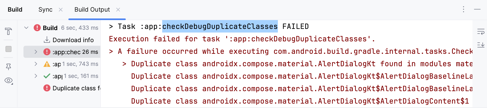

To fix this issue, add this to your app's build.gradle.kts :

```kotlin
configurations {
    "implementation" {
        exclude("org.jetbrains.compose.material", "material-desktop")
    }
}
```

Or if you're using Groovy gradle :

```groovy
configurations {
    api {
        exclude group: 'org.jetbrains.compose.material', module: 'material-desktop'
    }
}
```

---

# Introduction

## base module

Base module consists of some very basic yet powerful constructs :

### [UiEvent, BaseActivity & BaseViewModel](docs/BaseActivityAndViewModel.md)

When implemented, these help in emitting UI events from ViewModel to Activity (View). UI events supported :

| 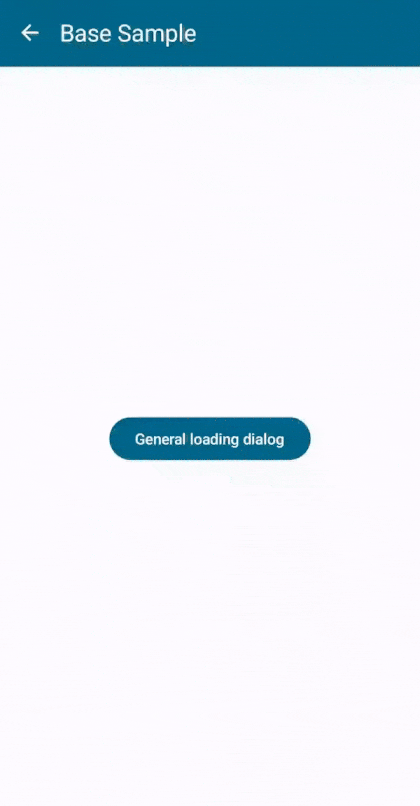 | 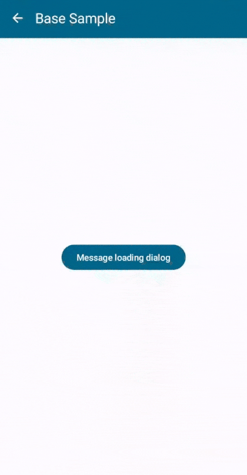 | 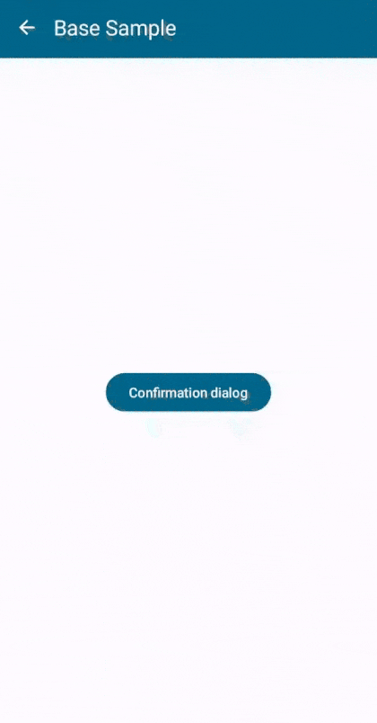 | 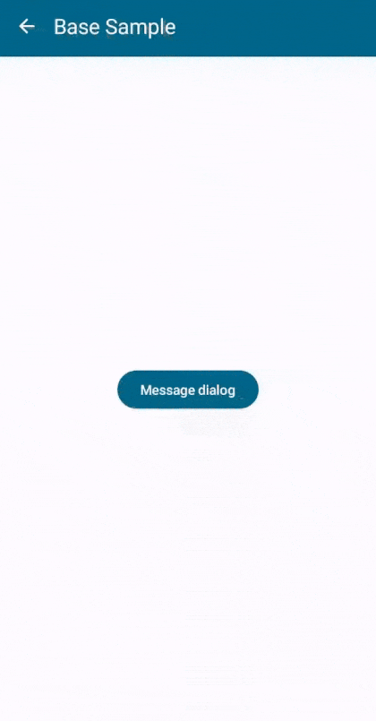 |
| --------------------------------------------------------------------------- | ---------------------------------------------------------------------------- | -------------------------------------------------------------------------- | --------------------------------------------------------------------- |

- Showing Toast

- Showing Message Dialog

- Showing Confirmation Dialog

- Showing Descriptive Error Dialog

- Showing Loading (Progress Indicator) Dialog

For each of these, you can invoke a simple function directly from your ViewModel :

```kotlin
class YourAmazingViewModel: BaseViewModel {

    fun yourFun() {
        showToast("Namaste World!")

        showMessageDialog("Registration Successful", "Welcome to DroidLibs!")


        showConfirmationDialog(
            title = "Confirm delete",
            message = "Are you sure? This can't be undone!",
            onConfirm = { userRepo.delete(phoneNo) }
        )

        showLoader("Launching rocket...")
    }
}
```

[](docs/BaseActivityAndViewModel.md)

---

### [TaskState](docs/TaskState.md)

TaskState class and its related functions makes it easy to work with Asynchronous tasks. The result of which, can either be **Success** or **Failure**. It provides a generic class so you can define it based on your result class.

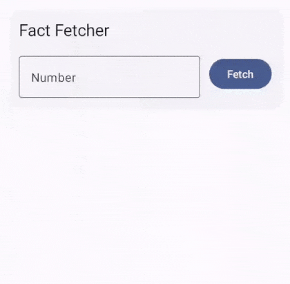

```kotlin
// 1. Define state
val fetchFactTask = taskStateOf<String>() // Here result is String

// 2. Composables 

// TaskLoadingButton (Displays Progress Indicator while loading)
TaskLoadingButton(
    state = fetchFactTask,
    label = "Fetch",
    onClick = fetchFact
)

// Displayed when loaded
fetchFactTask.whenLoaded { fact -> /* Display fact */ }

// Displayed when error
fetchFactTask.whenError { error -> /* Display error */ }

// 3. Execute task handling errors
fun fetchFact() {
    execute(fetchFactTask) {
        factRepo.getFact(numberInput.value())
    }
}
```

[](docs/TaskState.md)

---

### [Error Handling](docs/BaseActivityAndViewModel.md#error-handling--execute-functions)

Provides `execute()` functions with in-built error handling mechanisms.

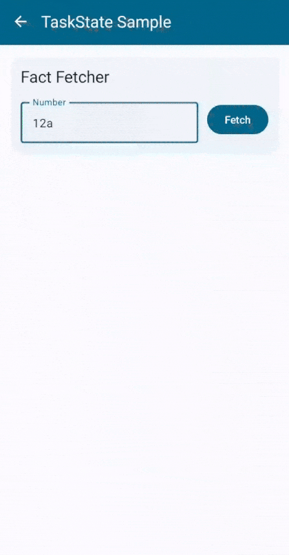

```kotlin
class MainViewModel : BaseViewModel() {

    fun registerUser(phoneNo: String, name: String) {
        execute {
            if (userRepo.userExists(phoneNo)) failure("User with phoneNo already exists!")
            userRepo.registerUser(phoneNo, name)
        }
    }
}
```

[](docs/BaseActivityAndViewModel.md#error-handling--execute-functions)

---

### [Helper Functions](docs/SomeHelperFunctions.md)

Provides functions like :

- `log()` to log from anywhere in the app

- `defaultContext()` to get a CoroutineContext with exception handler

- `defaultExceptionHandler()` to get a CoroutineExceptionHandler

- Execute function - `defaultExecuteHandlingError()` with error handling support

[](docs/SomeHelperFunctions.md)

---

## compose module

Compose module consists of several commonly used Composables :

### [TextInputLayout](docs/TextInputLayout.md)

TextInputLayout is an advanced TextField with several validation options : 

https://github.com/The-Streamliners/DroidLibs/assets/24524454/1d65edce-3c32-4888-99a9-a4874d7f37f7

1. Defining State
   
   ```kotlin
   val nameInput = remember {
       mutableStateOf(
           TextInputState(
               label = "Name",
               inputConfig = InputConfig.text {
                   optional = true
                   minLength = 5
                   maxLength = 30
               }
           )
       )
   }
   
   val aadharNoInput = remember {
       mutableStateOf(
           TextInputState(
               label = "Aadhar number",
               inputConfig = InputConfig.fixedLengthNumber(12)
           )
       )
   }
   
   val panNoInput = remember {
       mutableStateOf(
           TextInputState(
               label = "PAN number",
               inputConfig = InputConfig.text {
                   maxLength = 10
                   strictMaxLengthCheck = true
                   regexValidation = InputConfig.RegexValidation(
                       Regex("^[A-Z]{5}\\d{4}[A-Z]{1}$")
                   )
               }
           )
       )
   }
   ```

2. Composable
   
   ```kotlin
   TextInputLayout(state = nameInput)
   TextInputLayout(state = aadharNoInput)
   TextInputLayout(state = panNoInput)
   ```

3. Validation
   
   ```kotlin
   if (
       TextInputState.allHaveValidInputs(
           nameInput, ageInput, contactNoInput, emailInput, aadharNoInput, panNoInput, passwordInput
       )
   ) {
       // Proceed...
   }
   ```

[](docs/TextInputLayout.md)

---

### [TextInputDialog](docs/TextInputDialog.md)


A dialog to input some text with strong validation mechanism.

https://github.com/The-Streamliners/DroidLibs/assets/24524454/e69729af-b6d3-44af-b584-4856d4b2b315

```kotlin
textInputDialogState.value = TextInputDialogState.Visible(
    title = "Enter your birth year",
    input = mutableStateOf(
        TextInputState(
            label = "Year",
            inputConfig = InputConfig.fixedLengthNumber(4)
        )
    ),
    submit = { input ->
        val birthYear = input.toInt() // No need to worry about error; already handled by TIL
        val age = Calendar.getInstance().get(YEAR) - birthYear
        showMessageDialog("Age", "Your age is $age years.")
    }
)
```

[](docs/TextInputDialog.md)

---

### [OutlinedSpinner](docs/OutlinedSpinner.md)

TextField & Dropdown that allows user to select one of multiple options.


```kotlin
val state = remember {
    mutableStateOf(
        TextInputState("Country")
    )
}

OutlinedSpinner(
    options = listOf("Bharat", "USA", "Russia", "China"),
    state = state,
    allowInput = true
)
```

[](docs/OutlinedSpinner.md)

---

### [SearchAppBar](docs/SearchAppBar.md)


Integrate Search functionality on your screen with minimal effort :

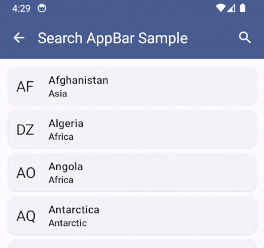

```kotlin
val searchAppBarState = rememberSearchAppBarState()

SearchAppBarScaffold(
    title = "Search AppBar Sample",
    navigateUp = { navController.navigateUp() },
    searchAppBarState = viewModel.searchAppBarState,
    onQueryChanged = viewModel::filter // <- Search event handler
) {
    // ... Content UI
}

// Inside ViewModel
fun filter(query: String) {
    // ... Filter the data and update state
}
```

[](docs/SearchAppBar.md)

---

### [Capturable](docs/Capturable.md)


`Capturable` is a composable that allows you to (capture / take snapshot of / take screenshot of) any composable.

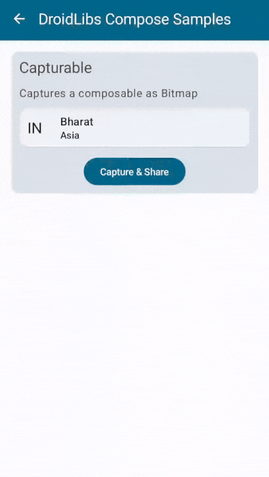

```kotlin
val captureState = rememberCaptureState()

Capturable(state = captureState) {
   // Place anything you wanna capture
}

Button(
   onClick = {
      captureState.capture { bitmap ->
         saveAndShareImage(bitmap)
      }
   }
) {
   Text(text = "Capture & Share")
}
```

[](docs/Capturable.md)

---

### [DrawingPad](docs/DrawingPad.md)


DrawingPad is a composable that allows user to draw on it.

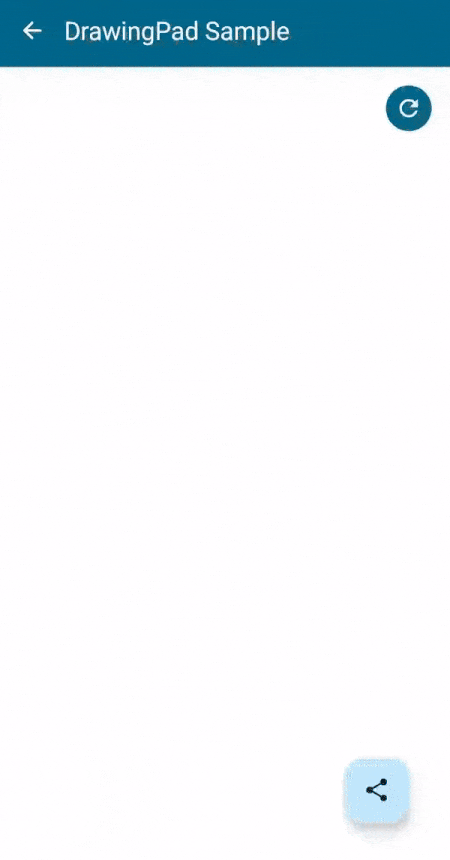

```kotlin
val drawingPadState = rememberDrawingPadState()

DrawingPad(
   modifier = Modifier.fillMaxSize(),
   state = drawingPadState
)

FloatingActionButton(
   onClick = {
      drawingPadState.capture { bitmap ->
         saveAndShareImage(bitmap)
      }
   }
) {
   Icon(
      imageVector = Icons.Default.Share,
      contentDescription = "Capture & Share"
   )
}
```

[](docs/DrawingPad.md)

---

### [TitleBar](docs/TitleBar.md)


```kotlin
TitleBarScaffold(
    title = "DroidLibs Sample",
    navigateUp = { navController.navigateUp() }
) { paddingValues ->
    // ... Content
}
```

[](docs/TitleBar.md)

---

### [LabelledCheckBox](docs/LabelledCheckBox.md)

  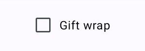

```kotlin
val checked = remember { mutableStateOf(false) }

LabelledCheckBox(
    state = checked,
    label = "Gift wrap"
)
```

[](docs/LabelledCheckBox.md)

---

### [RadioGroup](docs/RadioGroup.md)

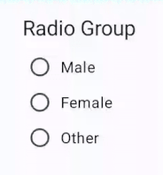

```kotlin
val gender = remember { mutableStateOf<String?>(null) }

RadioGroup(
    title = "Radio Group",
    state = gender,
    options = listOf("Male", "Female", "Other")
)
```

[](docs/RadioGroup.md)

---

### [LabelledRadioButton](docs/RadioGroup.md#labelledradiobutton)

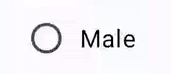

```kotlin
val gender by remember { mutableStateOf<String?>(null) }

LabelledRadioButton(
    label = "Male",
    selected = gender == "Male",
    onClick = { gender = "Male" }
)
```

[](docs/RadioGroup.md#labelledradiobutton)

---

### [BottomSheet](docs/BottomSheet.md)


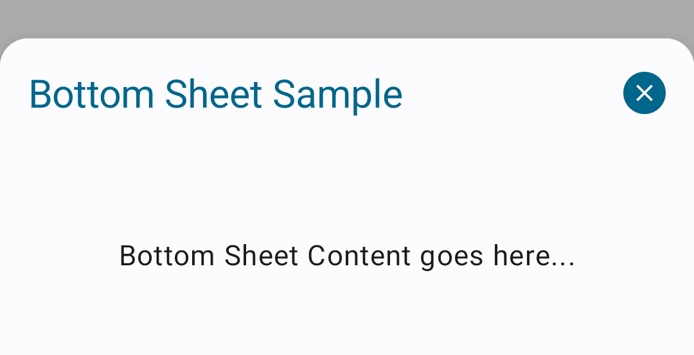

```kotlin
BottomSheet(
    title = "Bottom Sheet Sample",
    state = bottomSheetState
) {
    // Content...
}
```

[](docs/BottomSheet.md)

---

### [Other](docs/Other.md)

#### [FilledIconButtonSmall](docs/Other.md#fillediconbuttonsmall)

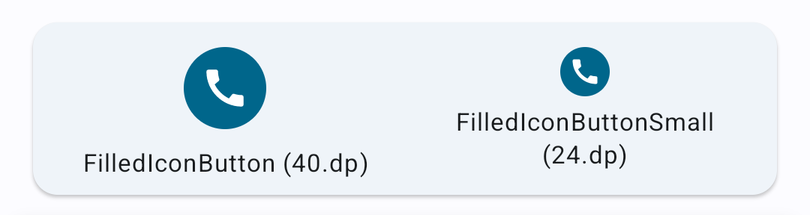

---

#### [Center & CenterText](docs/Other.md#center--centertext)

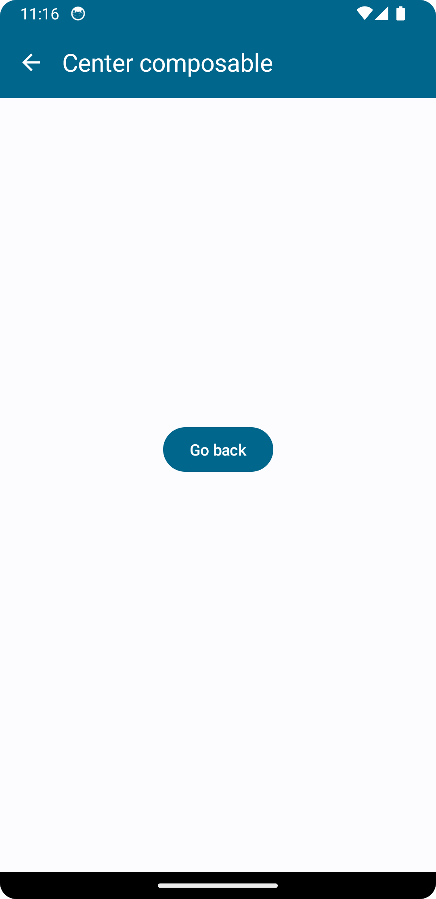

```kotlin
Center {
    Button(
        onClick = { navController.navigateUp() }
    ) {
        Text(text = "Go back")
    }
}
```

---

#### [noRippleClickable](docs/Other.md#norippleclickable)

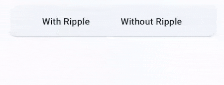

```kotlin
Text(
    modifier = Modifier
        .noRippleClickable {
            showToast("NO Ripple click")
        },
    text = "Without Ripple"
)
```

[](docs/Other.md)
