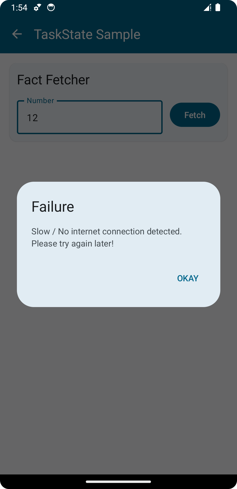
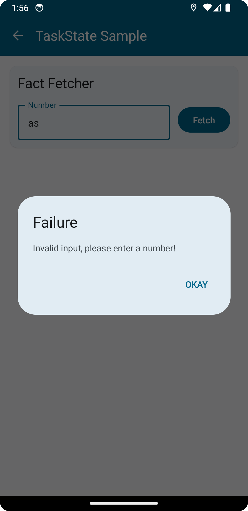
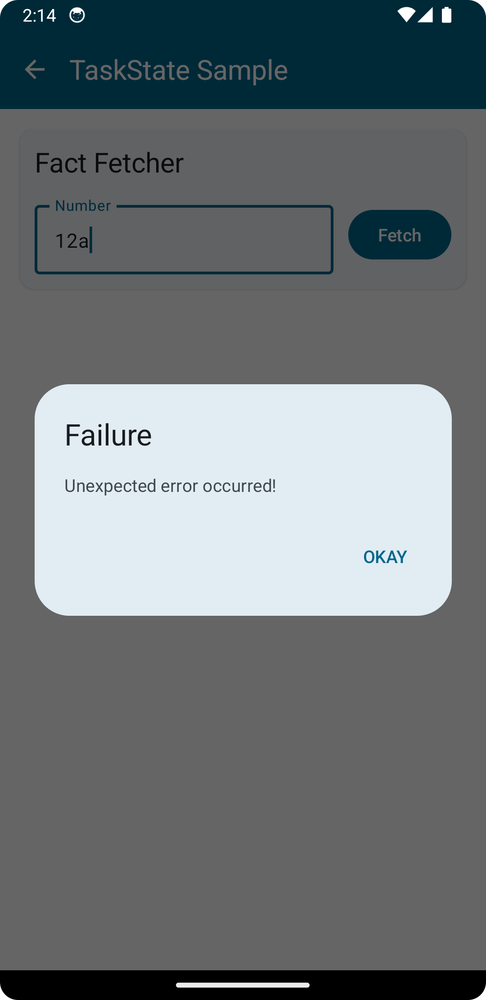

# BaseActivity & BaseViewModel

It is a well-known best practice that one should not hold the instance of `Activity` class in the `ViewModel`. Consider a scenario where you want to show a Toast or SnackBar from a function in `ViewModel`, how would you achieve that? Or maybe you want to show a loading dialog or a message dialog. Let's call these **UI events**. So, the problem statement is - *how to emit UI Events from ViewModel to view i.e. Activity or a Composable?* 

Note that the solution must be easily replicable following the **DRY** principle. Easiest solution that comes to mind is to have separate mutable states for each UI event. States for `Toast` & `LoadingDialog` could be :

```kotlin
val toastState = mutableStateOf<String?>(null)
val loadingDialogState = mutableStateOf(false)
```

Then to display a Toast or `LoadingDialog`, we can simply mutate the state :

```kotlin
class SomeViewModel: ViewModel() {

    // States...

    fun showToast(message: String) {
        toastState.value = message
    }

    fun showLoadingDialog() {
        loadingDialogState.value = true
    }
}
```

Next, we can define Composables for these states and pass in the respective states. But to replicate this solution in multiple ViewModels is impossible while following the DRY principle as it requires declaring the same states in each ViewModel. 

To solve for this use case, we came up with `BaseActivity` & `BaseViewModel` which does this heavy lifting for you. Out of the box, it provides the following features :

- Emit UI events like showing a Toast, LoadingDialog, MessageDialog, ConfirmationDialog

- Error handling

- Execute functions with network check and retry capability

## Setup

1. Make your `Activity` inherit from `BaseActivity` :
   
   ```kotlin
   class MainActivity : BaseActivity() { /*...*/ }
   ```

2. In the `setContent()` function, invoke the `UiEventDialogs()` composable :
   
   ```kotlin
   override fun onCreate(savedInstanceState: Bundle?) {
       super.onCreate(savedInstanceState)
       setContent {
           YourAmazingTheme {
               YourAmazingApp()
               UiEventDialogs() // Add this
           }
       }
   }
   ```

3. Make your `ViewModel` inherit from `BaseViewModel` :
   
   ```kotlin
   class MainViewModel : BaseViewModel() { /*...*/ }
   ```

4. Whenever creating an instance of the `ViewModel`, use our pre-defined functions :
   
   ```kotlin
   // Option 1 : No DI
   fun <T: BaseViewModel> BaseActivity.baseViewModel(): T 
   
   // Option 2 : DI using Dagger-Hilt
   fun <T: BaseViewModel> BaseActivity.hiltBaseViewModel(): T
   
   // Option 3 : DI using Koin
   fun <T: BaseViewModel> BaseActivity.koinBaseViewModel(): T
   ```

> Note that all are extension functions of `BaseActivity`. So make sure you are invoking them from the right context.

Example :

```kotlin
@Composable
fun BaseActivity.YourAmazingApp() {
    val navController = rememberNavController()

    NavHost(
        navController = navController,
        startDestination = Route.SplashScreen.route
    ) {

        composable(Route.MainScreen.route) {
            MainScreen(
                viewModel = hiltBaseViewModel()
            )
        }
    }
}
```

5. Override the debug variable in BaseActivity to inform the library about the build variant i.e. DEBUG or RELEASE :
   
   ```kotlin
   class MainActivity : BaseActivity() { 
       override var debugMode: Boolean = BuildConfig.BUILD_TYPE == "debug"
   }
   ```

That's it! That's all you need to do for unlocking some very helpful functions. Let's now see what all you can achieve from this.

## Emitting UI events

From any `BaseViewModel` inheriting `ViewModel`, you can use the following functions to emit UI events :

1. Showing Toast
   
   ```kotlin
   fun BaseViewModel.showToast(
       message: String,
       duration: Duration = Short
   )
   ```
   
   BaseActivity keeps track of the last toast displayed, helping in cancelling it when a new toast is displayed.

2. Show / Hide LoadingDialog (Loader)
   
   ```kotlin
   fun BaseViewModel.showLoader(message: String? = null)
   
   fun BaseViewModel.hideLoader()
   ```
   
   When a message is passed, a blocking dialog with circular progress indicator (CPI) and a message is displayed :
   
   
   
   Otherwise only the CPI is displayed :
   
   
   
   You can customize the general CPI LoadingDialog UI by overriding this composable in your `Activity` class :
   
   ```kotlin
   @Composable open fun GeneralLoadingDialog()
   ```

3. Show MessageDialog
   
   ```kotlin
   fun BaseViewModel.showMessageDialog(
       title: String,
       message: String
   )
   
   // or for a failure where title is always "Failure" :
   fun BaseViewModel.showFailureMessage(message: String)
   ```
   
   
   
   If you need more control on the message dialog i.e. isCancellable, it's buttons, their labels and handlers, consider calling this overloaded function by passing in an instance of `UiEvent.ShowMessageDialog` class :
   
   ```kotlin
   fun BaseViewModel.showMessageDialog(
       event: UiEvent.ShowMessageDialog
   )
   ```
   
   The `UiEvent.ShowMessageDialog` class :
   
   ```kotlin
   class ShowMessageDialog(
       val title: String,
       val message: String,
       val isCancellable: Boolean = true,
       val positiveButton: DialogButton = DialogButton("OKAY") {},
       val negativeButton: DialogButton? = null,
       val neutralButton: DialogButton? = null,
   )
   
   class DialogButton(
       val label: String,
       val dismissOnClick: Boolean = false,
       val handler: () -> Unit = {}
   )
   ```
   
   Sample usage :
   
   ```kotlin
   showMessageDialog(
       UiEvent.ShowMessageDialog(
           title = "Unsaved changes",
           message = "Changes made will be discarded. Sure to exit?",
           isCancellable = false,
           positiveButton = DialogButton(
               label = "YES",
               dismissOnClick = true,
               handler = { navigateBack() }
           ),
           negativeButton = DialogButton(
               label = "NO",
               dismissOnClick = true
           )
       )
   )
   ```

4. Show ConfirmationDialog
   
   ```kotlin
   fun BaseViewModel.showConfirmationDialog(
       title: String,
       message: String,
       confirmButtonLabel: String = "YES",
       onConfirm: () -> Unit
   )
   ```
   
   
   
   Sample usage :
   
   ```kotlin
   class MainViewModel : BaseViewModel() {
   
       fun deleteUser(phoneNo: String) {
           showConfirmationDialog(
               title = "Confirm delete",
               message = "Are you sure? This can't be undone!",
           ) {
               execute {
                   userRepo.delete(phoneNo)
               }
           }
       }
   }
   ```

> All functions except the `showConfirmationDialog()` are available in BaseActivity also.

## Error handling & Execute functions

For Error handling, `BaseViewModel` provides execute functions wherein you pass a suspend lambda to be executed, enabling you to use the following features :

- If any error occurs in the execution of lambda, an error dialog is displayed with the error message. 

- You get to toggle features like pre network check and whether to show a retry button in case if error occurs.

- Display loading dialog while execution. Also, you can provide a suspend lambda to be invoked post main lambda execution (after the LoadingDialog hides).

Function signature :

```kotlin
fun BaseViewModel.execute(
    showLoadingDialog: Boolean = true,
    networkCheck: Boolean = true,
    allowRetry: Boolean = false,
    postExecution: (suspend CoroutineScope.() -> Unit)? = null,
    lambda: suspend CoroutineScope.() -> Unit
)
```

Sample usage :

```kotlin
class MainViewModel : BaseViewModel() {

    fun likePost(id: Int) {
        execute {
            postRepo.likePost(id)
        }
    }
}
```

By default, it executes the lambda on the IO Dispatcher. Similar function is also available in BaseActivity :

```kotlin
fun BaseActivity.execute(
    showLoadingDialog: Boolean = true,
    networkCheck: Boolean = true,
    dispatchers: CoroutineContext = Dispatchers.IO,
    lambda: suspend CoroutineScope.() -> Unit
)
```

### Error handling

`BaseViewModel` & `BaseActivity` have deployed a `CoroutineExceptionHandler` behind the scenes, which, whenever an error occurs emits different UI event depending on the type of error that occurred. 

Following are the possibilities, when an exception is thrown :

- If any of [`SocketTimeoutException`, `ConnectException`, `UnresolvedAddressException`, `UnknownHostException`, `OfflineException`] is thrown, then a failure message dialog is shown with the message : "Slow / No internet connection detected. Please try again later!".
  
  

- If a `BusinessException` occurs (defined below), the error message of the exception is displayed as is, in a message dialog.
  
  

- For any other exception that occurs, 
  
  - if it's a DEBUG build, exception message & stacktrace is displayed in a message dialog along with an optional copy button.
    
    
  
  - otherwise (RELEASE build), a general message "Something went wrong!" is displayed.
    
    

#### Business Exception

Here we introduce a new `Exception` sub-class - `BusinessException`. It can be defined as an exception not occurring due to a programming error but an user relevant reason. A simple example could be displaying *"No items to display"* when a filter applied by the user in an e-commerce app matches zero products. It is not a programming error but a result of user performed action. For such exceptions, exception handler simply displays the exception message to the user, irrespective of the build type (i.e. DEBUG or RELEASE) because it is relevant to user only.

```kotlin
class BusinessException(
    override val message: String,
    val level: Level = MEDIUM
): Exception(message) {

    enum class Level {
        LOW,    // Toast is shown
        MEDIUM, // Cancellable dialog is shown
        HIGH    // Non-Cancellable dialog is shown, closes app on button click
    }
}
```

To throw such exceptions, use the `failure()` function :

```kotlin
fun failure(
    message: String,
    level: Level = MEDIUM
): Nothing
```

By passing in the level, you are in control as to how the error is displayed to the user.

Sample usage :

```kotlin
class MainViewModel : BaseViewModel() {

    fun registerUser(phoneNo: String, name: String) {
        execute {
            if (userRepo.userExists(phoneNo)) failure("User with phoneNo already exists!")
            userRepo.registerUser(phoneNo, name)
        }
    }
}
```

Note that because `failure()` function returns `Nothing`, there is no need of an `return` statement in the `failure()` invoking branch.

```kotlin
class MainViewModel : BaseViewModel() {

    fun registerUser(phoneNo: String, name: String) {
        execute {
            if (userRepo.userExists(phoneNo)) {
                failure("User with phoneNo already exists!")
                return // Redundant, not required
            }
            userRepo.registerUser(phoneNo, name)
        }
    }
}
```

#### Support for Crash analytics

To report the exception to a Crash analytics service like Firebase Crashlytics, you can override the `onExceptionOccurred()` function of `BaseActivity` :

```kotlin
open fun onExceptionOccurred(e: Throwable)
```

It is called for every exception that occurs in `BaseActivity` or `BaseViewModel's` execute functions.

#### LoggedOut Exception

There might be multiple points in the app where the user has to be logged out immediately. One is when receiving a 401 while making an API call. To handle all logout cases at one place, you can simply throw our LoggedOutException from `execute()` functions. Doing so ultimately results in the invocation of BaseActivity's `logout()` function :

```kotlin
open fun logout()
```

Overriding this you can clear local data and navigate the user to LoginScreen.

### Other features

- You can check whether the device is connected to the internet simply by calling the function `isConnected()` (accessible from both `Activity` & `ViewModel`) :
  
  ```kotlin
  fun isConnected(): Boolean
  ```

- BaseActivity provides a function - `copyText()` to copy text to Clipboard :
  
  ```kotlin
  fun BaseActivity.copyText(message: String, label: String = "Text")
  ```

- BaseViewModel provides a function - `executeOnMain()` to switch context to the Main Dispatcher and execute a lambda :
  
  ```kotlin
  suspend fun BaseViewModel.executeOnMain(
    lambda: suspend () -> Unit
  )
  ```
  
  > Note : This function does not perform error handling

- BaseViewModel provides a function - `showingLoader()` which displays a LoadingDialog while the passed lambda executes :
  
  ```kotlin
  suspend fun BaseViewModel.showingLoader(
    lambda: suspend () -> Unit
  )
  ```
  
  Sample usage :
  
  ```kotlin
  fun fetchFact() {
      execute(showLoadingDialog = false) {
  
          val num = numberInput.value().toIntOrNull()
              ?: failure("Invalid input, please enter a number!")
  
          showingLoader {
              fact.update(
                  factRepo.getFact(num)
              )
          }
  
          logger.logEvent()
      }
  }
  ```
