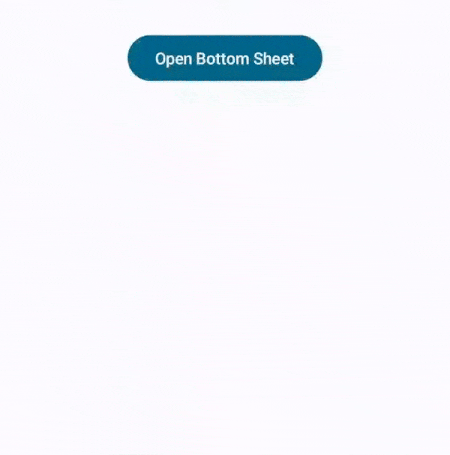

# BottomSheet


BottomSheet is wrapper around the Material UI's `ModalBottomSheet` with following additional features :

- Displays a title

- Displays a close bottom at top right corner

- Handles back click for closing the bottom sheet

## Usage

### Step 1 : Define state

Define a simple `MutableState<Boolean>`

```kotlin
val bottomSheetState = remember { mutableStateOf(false) }
```

### Step 2 : Composable

Use the following composable function :

```kotlin
fun BottomSheet(
    title: String,
    state: MutableState<Boolean>,
    content: @Composable () -> Unit
)
```

Example :

```kotlin
BottomSheet(
    title = "Bottom Sheet Sample",
    state = bottomSheetState
) {
    Text(
        modifier = Modifier.fillMaxWidth()
            .padding(horizontal = 24.dp, vertical = 50.dp),
        text = "Bottom Sheet Content goes here...",
        textAlign = TextAlign.Center,
        style = MaterialTheme.typography.bodyLarge
    )
}
```

### Step 3 : Show BottomSheet

To show the bottom sheet, just mutate the state to true value :

```kotlin
Button(
    onClick = { bottomSheetState.value = true }
) {
    Text(text = "Open Bottom Sheet")
}
```


