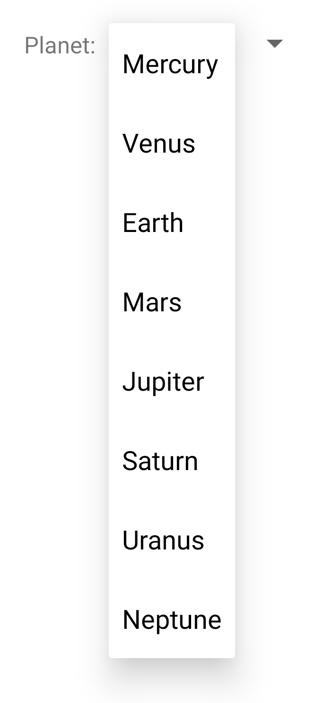
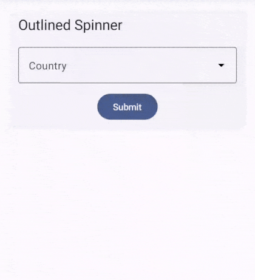
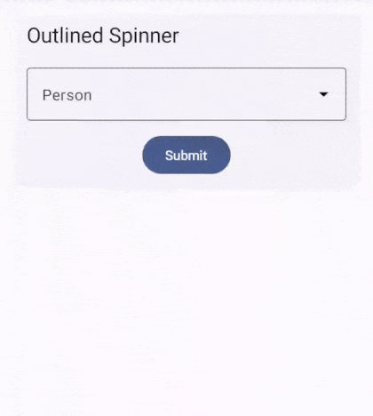
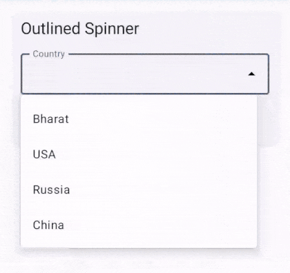
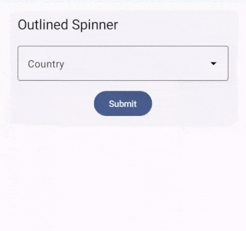

# OutlinedSpinner

In the XML way of building UIs for Android, there is a widget called [Spinner](https://developer.android.com/develop/ui/views/components/spinner) that allows user to select one option out of multiple using a dropdown menu. 



But there is no equivalent composable for it in Jetpack Compose. We provide this important composable covering multiple use cases.

## String based



If you have `options: List<String>` and want the user to select one among it, then use the following composable :

```kotlin
@Composable
fun OutlinedSpinner(
    modifier: Modifier = Modifier,

    // Core props
    options: List<String>,
    state: MutableState<TextInputState>,
    onStateChanged: (String) -> Unit = {},

    // Customization
    allowInput: Boolean = false,
    icon: ImageVector? = null,
    parentScrollState: ScrollState? = null,
)
```

Example :

```kotlin
val state = remember {
    mutableStateOf(
        TextInputState("Country")
    )
}

OutlinedSpinner(
    options = listOf("Bharat", "USA", "Russia", "China"),
    state = state
)

Button(
    modifier = Modifier.align(Alignment.CenterHorizontally),
    onClick = {
        if (state.hasValidInput()) {
            showMessageDialog(
                title = "Confirm selection",
                message = "You selected : ${state.value()}"
            )
        }
    }
) {
    Text(text = "Submit")
}
```

> `OutlinedSpinner` uses `TextInputLayout` internally, so it requires `TextInputState` as its state. Note that `InputConfig` validations don't work here, because valid options list is provided by you. Still, you can use the `InputConfig#optional` parameter.

## Generic (Custom class based)



Suppose you have `persons: List<Person>` where `Person` class is defined as :

```kotlin
data class Person(
    val id: Int,
    val name: String
)
```

Now you want the user to select one among these `persons` :

```kotlin
listOf(
    Person(1, "Swami Vivekananda"),
    Person(2, "Dr. Homi J. Bhabha"),
    Person(3, "Dr. Vikram Sarabhai"),
    Person(4, "Dr. APJ Abdul Kalam")
)
```

If you were to use the above explained String based Spinner, mapping

```kotlin
persons: List<Person> -> to -> names: List<String>
```

would be required. Further, after selection, selected person name had to be looked up in persons list to get the selected Person object. This seems like a long process for such a small task!

To solve for this specific use case, we have a generic version also. You could provide a generic `List<T>` and user would be selecting one of these objects, `T`.

### Step 1 : Define the SpinnerState

```kotlin
class SpinnerState<T>(
    val selection: MutableState<T?>,
    val textInputState: MutableState<TextInputState>,
    val labelExtractor: (T) -> String
)
```

Example :

```kotlin
val state = remember {
    SpinnerState<Person>(
        selection = mutableStateOf(null), // Perfill value can be defined here
        textInputState = mutableStateOf(TextInputState("Person")),
        labelExtractor = { it.name } // Specified what label to display for the object T
    )
}
```

### Step 2 : Composable

```kotlin
@Composable
fun <T> OutlinedSpinner(
    modifier: Modifier = Modifier,
    
    // Core props
    options: List<T>,
    state: SpinnerState<T>,
    onStateChanged: (T) -> Unit = {  },

    // Customization
    allowInput: Boolean = false,
    leadingIcon: ImageVector? = null,
    parentScrollState: ScrollState? = null,
)
```

Example :

```kotlin
OutlinedSpinner(
    options = listOf(
        Person(1, "Swami Vivekananda"),
        Person(2, "Dr. Homi J. Bhabha"),
        Person(3, "Dr. Vikram Sarabhai"),
        Person(4, "Dr. APJ Abdul Kalam")
    ),
    state = state,
    allowInput = true
)
```

### Step 3 : Validation and accessing selection

To validate whether user has selected the value and access the selected value simultaneously, use the `ifSelected()` function and pass the lambda to handle the if selected case, wherein you get the selected value - `T` :

```kotlin
fun ifSelected(
    lambda: (T) -> Unit
) 
```

Example :

```kotlin
Button(
    onClick = {
        state.ifSelected { person ->
            showMessageDialog(
                title = "Confirm selection",
                message = "You selected : $person"
            )
        }
    }
) {
    Text(text = "Submit")
}
```

## Customizations

### Auto Complete

By default, the Spinner does not allow keyboard inputs. If you want the auto complete functionality wherein, user can type and list of suggestions will be filtered based on that, like this :



This feature is provided out of the box. Just pass allowInput: Boolean parameter as `true` :

```kotlin
OutlinedSpinner(
    options = listOf("Bharat", "USA", "Russia", "China"),
    state = state,
    allowInput = true
)
```

#### Known Issue



The drop down hides abruptly as soon as the user starts typing. Spinner has to clicked to display the drop down again. This might be because of focusability. Initially, Spinner is in focus so drop down is shown. But when the user types, focus is lost so drop down hides. This issue is open & not yet fixed. Feel free to fix this!

### Leading Icon

You can pass a `leadingIcon: ImageVector` to be displayed in the `OutlinedTextField` of the spinner.

Example :

```kotlin
OutlinedSpinner(
    options = listOf("Bharat", "USA", "Russia", "China"),
    state = state,
    leadingIcon = Icons.Default.Star
)
```
