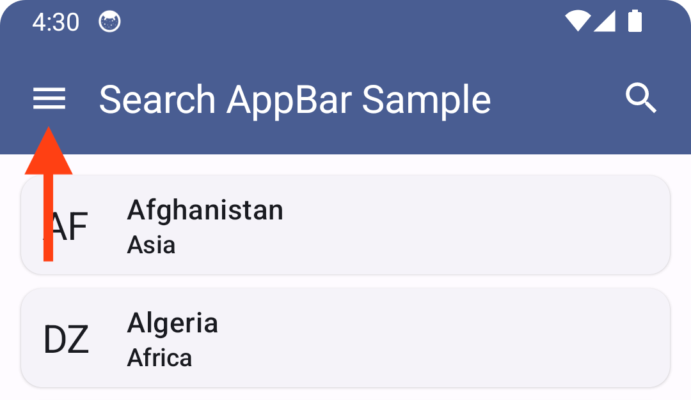
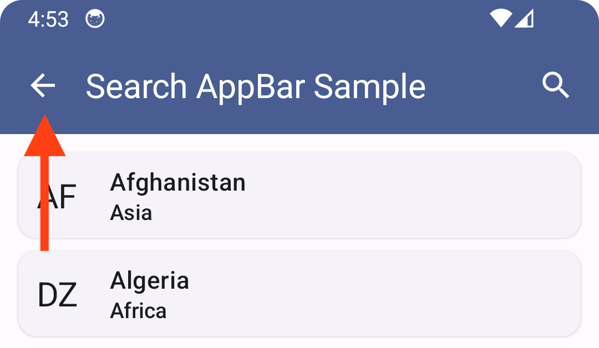
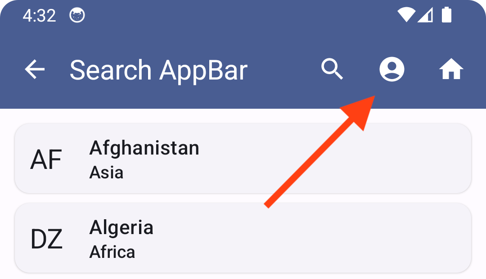

# SearchAppBar

`SearchAppBar` is an `AppBar` with search functionality. It is in the `Closed` state by default, when only title, actions and an optional up navigation button are displayed. A Search action button is also displayed which when clicked, displays the Search widget.


## Usage

### Step 1 : Define the state

```kotlin
// In composable
val searchAppBarState = rememberSearchAppBarState()

// Or in ViewModel
val searchAppBarState = searchAppBarState()
```

Both the functions return an instance of `MutableState<SearchAppBarState>` initialized with the `Closed` state.

### Step 2 : Composable

```kotlin
@Composable
fun SearchAppBarScaffold(
    title: String,
    searchHint: String = "Search here...",
    searchAppBarState: MutableState<SearchAppBarState>,
    onQueryChanged: (String) -> Unit,
    navigationIcon: (@Composable () -> Unit)? = null,
    navigateUp: (() -> Unit)? = null,
    content: @Composable (PaddingValues) -> Unit
)
```

Instead of using the normal `Scaffold` and defining your own `AppBar`, use this `SearchAppBarScaffold`. It will handle everything related to the Search widget for you.

### Step 3 : Handle the search event

Whenever the query entered by user in the Search widget changes, the `onQueryChanged` lambda parameter is invoked, with the recent most query passed in.

Example :

```kotlin
SearchAppBarScaffold(
    title = "Search AppBar Sample",
    navigateUp = { navController.navigateUp() },
    searchAppBarState = viewModel.searchAppBarState,
    onQueryChanged = viewModel::filter // <- Search event handler
) {
    // ... Content UI
}

// Inside ViewModel
fun filter(query: String) {
    // ... Filter the data and update state
}
```

### Defining your own Scaffold

If you wish to defined your own `Scaffold` and still be able to use `SearchAppBar`, you can do so using the `SearchAppBar` composable function :

```kotlin
@Composable
fun SearchAppBar(
    title: String,
    searchHint: String = "Search here...",
    searchAppBarState: MutableState<SearchAppBarState>,
    onQueryChanged: (String) -> Unit,
    navigationIcon: (@Composable () -> Unit)? = null,
    navigateUp: (() -> Unit)? = null,
    actions: @Composable RowScope.() -> Unit = {}
)
```

You can use it inside your own Scaffold like this :

```kotlin
Scaffold(
    modifier = Modifier.fillMaxSize(),
    topBar = {
        SearchAppBar(
            title = "Search AppBar Sample",
            searchAppBarState = viewModel.searchAppBarState
        )
    }
) {
    // ... Content
}
```

## Customizations

### Customize trigger

To trigger (open) search via some other button, like a `FAB`, then hide the default Search action button in the `TopAppBar` by passing `showSearchActionButton` as `false` :

```kotlin
SearchAppBarScaffold(
    // ...
    showSearchActionButton = false
) {
    // ...
}
```

In the `onClick` of the other button that you create, invoke the following function :

```kotlin
fun MutableState<SearchAppBarState>.open()
```

Example :

```kotlin
FloatingActionButton(
    onClick = { searchAppBarState.open() }
) {
    Icon(
        imageVector = Icons.Default.Search,
        contentDescription = "Search"
    )
}
```

Similarly for closing the widget, we have `close()` function too.

### navigationIcon

You can provide a navigation icon to be displayed to the left of title in the `Closed` `SearchAppBar` using the navigationIcon composable. 



Example :

```kotlin
SearchAppBarScaffold(
    // ...
    navigationIcon = {
        IconButton(
            onClick = { openDrawer() } 
        ) {
            Icon(
                imageVector = Icons.Default.Menu,
                contentDescription = "Drawer"
            )
        }
    }
    // ...
)
```

Alternatively, if you want the up navigation feature, then define the `navigateUp` parameter. 



Example :

```kotlin
SearchAppBarScaffold(
    // ...
    navigateUp = { navController.navigateUp() }
    // ...
)
```

If both are provided, priority will be given to the navigationIcon composable. 

### actions

You can provide one or more action buttons to be displayed at the end of `Closed` `SearchAppBar`. 



Example :

```kotlin
SearchAppBarScaffold(
    // ...
    actions = {
        IconButton(
            onClick = { navigateToProfile() }
        ) {
            Icon(
                imageVector = Icons.Default.AccountCircle,
                contentDescription = "Account"
            )
        }

        IconButton(
            onClick = { navigateToHome() }
        ) {
            Icon(
                imageVector = Icons.Default.Home,
                contentDescription = "Home"
            )
        }
    }
    // ...
)
```

## Helpful functions

```kotlin
// Returns whether Search widget is open
fun SearchAppBarState.isOpened (): Boolean

// Returns whether Search widget is open AND query is not empty 
fun SearchAppBarState.isFilterActive(): Boolean

// Return the query string input by user
fun SearchAppBarState.query(): String
```
