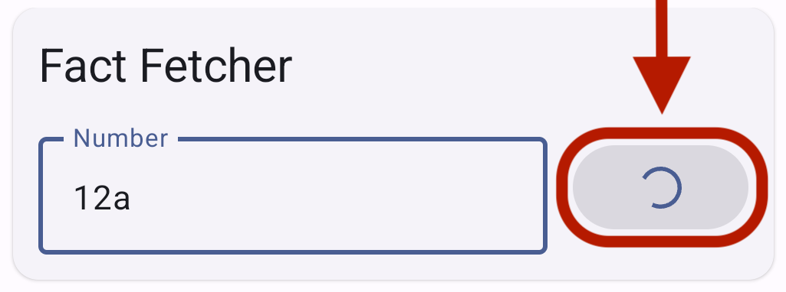
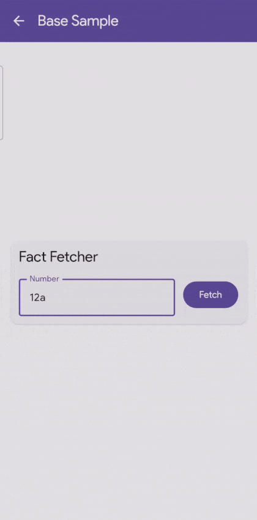
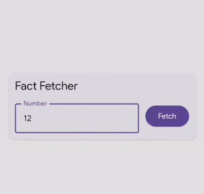

# TaskState

In almost every app, there is a need to make a network request. The result of which, can either be **Success** or **Failure**.

- When succeeded, we get the data we wanted or acknowledgement if no data is required.
- In case of Failure, we may want the user to know what went wrong.

To simplify the State Management of such tasks, we have defined a sealed class named `TaskState` : 

```kotlin
sealed class TaskState<T> {

    class New<T>: TaskState<T>()

    class Loading<T>: TaskState<T>()

    class Data<T>(
        val data: T
    ): TaskState<T>()

    class Error<T>(
        val error: String,
        val throwable: Throwable
    ): TaskState<T>()
}
```

## Initialization

It is a generic class, where the type parameter - `T` can be defined by you. It will be the type of result you are expecting from the execution of the task. For example, for fetching a number fact from the numbersApi.com, the type of result we're expecting is a `String`. So we create a `TaskState` of type `String` :

```kotlin
val fetchFactTaskState = taskStateOf<String>()  
```

Observe that `taskStateOf<T>()` is an initializer function that creates an instance of `MutableState<TaskState<T>>` with the initial value `TaskState.New()`. The function definition of the same is :

```kotlin
fun <T> taskStateOf(): Task<T> {
    return mutableStateOf(TaskState.New())
}
```

To simplify the name we have defined a type alias for `MutableState<TaskState<T>>` as `Task<T>` :

```kotlin
typealias Task<T> = MutableState<TaskState<T>>
```

Next obvious step is to execute the task. There are 3 ways to do this depending on how you want to handle the loading & error states.

## Approach 1 : Standalone execution

In this type of execution, the main composable related to the task is responsible to handle the loading & error states i.e. showing a progress indicator when loading and displaying the error when an error occurs. 

The final output looks like this :


Here is the composable for this :

```kotlin
@Composable
fun FactFetcherStandaloneComp(
    number: MutableState<TextInputState>,
    fetchFactTask: Task<String>,
    fetchFact: () -> Unit
) {

    // Number Input is hidden for simplicity

    // Fetch button
    TaskLoadingButton(
        state = fetchFactTask,
        label = "Fetch",
        onClick = fetchFact
    )

    // Fact (to be shown when loaded)
    fetchFactTask.whenLoaded { fact ->
        Text(
            modifier = Modifier
                .fillMaxWidth()
                .padding(8.dp),
            textAlign = TextAlign.Center,
            style = MaterialTheme.typography.labelLarge,
            text = fact
        )
    }

    // Error (to be shown in case of an error)
    fetchFactTask.whenError { error ->
        Text(
            modifier = Modifier
                .fillMaxWidth()
                .padding(8.dp),
            textAlign = TextAlign.Center,
            style = MaterialTheme.typography.labelMedium,
            color = MaterialTheme.colorScheme.error,
            text = error
        )
    }
}
```

### TaskLoadingButton

Notice that in the demo, the *Fetch* button itself displays the Circular Progress Indicator while loading, thanks to the pre-defined `TaskLoadingButton` composable. 



Here is its signature :

```kotlin
@Composable
fun <T> TaskLoadingButton(
    modifier: Modifier = Modifier,
    state: MutableState<TaskState<T>>,
    label: String,
    onClick: () -> Unit
)
```

### Task's State based composables

Instead of manually doing the Task's state checks like this :

```kotlin
val state = fetchFactTask.value 
if (state is TaskState.Data) {
    state.data // Use the data
}
```

you can use the pre-defined composables based on the state you want to target. The above code can be written in a compact way as :

```kotlin
fetchFactTask.whenLoaded { fact ->
    // Use the data
}
```

Similarly we provide several similar composable functions :

```kotlin
@Composable
fun <T> Task<T>.whenNew(
    content: @Composable () -> Unit
)

@Composable
fun <T> Task<T>.whenLoading(
    content: @Composable () -> Unit
)

@Composable
fun <T> Task<T>.whenNotLoading(
    content: @Composable () -> Unit
)

@Composable
fun <T> Task<T>.whenLoaded(
    content: @Composable (data: T) -> Unit
)

@Composable
fun <T> Task<T>.whenNotLoaded(
    content: @Composable () -> Unit
)

@Composable
fun <T> Task<T>.whenError(
    content: @Composable (error: String) -> Unit
)
```

If you want to define the UI for all states at once, you can use the `ui()` function :

```kotlin
@Composable
fun <T> Task<T>.ui(
    whenNew: @Composable () -> Unit = { },
    whenLoading: @Composable () -> Unit = { },
    whenLoaded: @Composable (data: T) -> Unit = { },
    whenError: @Composable (error: String) -> Unit = { }
)
```

### Execute function

Here is the handler for the onClick of `TaskLoadingButton` *Fetch* :

```kotlin
fun fetchFactUsingTaskExecutor() {
    execute(fetchFactTask) {
        factRepo.getFact(numberInput.value())
    }
}
```

`execute()` is a pre-defined function of `BaseViewModel` that executes the passed lambda in `ViewModelScope` with `IO Dispatcher`. Moreover, it can do network check and change the state to `TaskState.Loading()` before executing the lambda. Here is its signature :

```kotlin
fun <T> BaseViewModel.execute(
    task: MutableState<TaskState<T>>,
    dispatcher: CoroutineDispatcher = Dispatchers.IO,
    networkCheck: Boolean = true,
    lambda: suspend () -> T
)
```

Note that if you invoke this function multiple times, then each time the lambda will be executed. Instead, you may want to execute the task only once even if the handler is called multiple times. For this single execution, you can use the `executeIfNotLoaded()` function :

```kotlin
fun <T> BaseViewModel.executeIfNotLoaded(
    task: MutableState<TaskState<T>>,
    dispatcher: CoroutineDispatcher = Dispatchers.IO,
    networkCheck: Boolean = true,
    lambda: suspend () -> T
)
```

## Approach 2 : Delegate error handling



If you are using `BaseViewModel`'s general `execute()` functions for error handling or have your own error handling mechanism, you can remove the `fetchFactTask.whenError()` composable invocation. Post that you should not use the `execute(task)` function because it will silently update the task state to `TaskState.Error()` and won't be re-throwing the error for your error handling mechanism to notice. 

Instead, you should use the `Task<T>.load()` extension function :

```kotlin
fetchFactTask.load {
    factRepo.getFact(numberInput.value())
}
```

`load()` function mutates the state value to `TaskState.Loading()` and then executes the lambda passed.

Beware that any error thrown must be handled by you now. If you are using `BaseViewModel`'s general `execute()` function, error handling is already taken care of :

```kotlin
fun fetchFact() {
    execute(showLoadingDialog = false) {
        fetchFactTask.load {
            factRepo.getFact(numberInput.value())
        }
    }
}
```

`BaseActivity` will automatically display the error dialog when an error occurs.

## Approach 3 : Delegate progress indicator also



BaseViewModel provides the functionality of displaying a loading dialog. You can use that generic one while execution of the Task. Or you can implement your own mechanism for indicating progress.

```kotlin
fun fetchFactUsingLoadingDialog() {
    execute {
        fetchFactTask.update(
            factRepo.getFact(numberInput.value())
        )
    }
}
```

This way, you should replace the TaskLoadingButton with a simple button because now Task composable is not responsible for indicating progress. We have delegated that task to BaseViewModel & BaseActivity. Same goes for error handling too.

## Sample code

Sample code for all three approaches can be found [here](../app/src/main/java/com/streamliners/feature/task_state_sample). 
