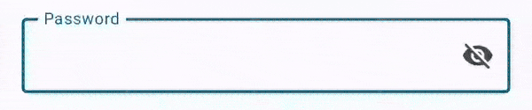
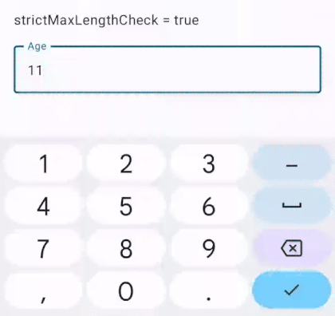
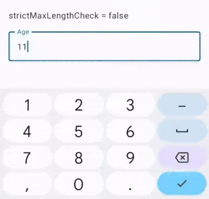

# TextInputLayout

`TextInputLayout` is a wrapper around the `OutlinedTextField` composable of Material library. It provides a very useful but important feature - **<u>Input validation</u>**, which is absent in the base composable.

https://github.com/The-Streamliners/DroidLibs/assets/24524454/1d65edce-3c32-4888-99a9-a4874d7f37f7

Edge cases handled :

- Start with no errors initially

- Validate length and required checks as and when input changes

- Optionally prevent further input after maxLength limit is reached

- Hide "Required!" error as soon a input is added 

## Basic usage

Usually you would define a `MutableState<String>` for an `OutlinedTextField`, but for a `TextInputLayout`, define a `MutableState<TextInputState>` :

```kotlin
val nameInput = remember {
    mutableStateOf(
        TextInputState(label = "Name")
    )
}
```

> Observe that `label` is a part of state. Moving ahead you will find more such OutlinedTextField's parameters as a property of `TextInputState` class. 

Composable for this state :

```kotlin
TextInputLayout(state = nameInput)
```

Yeah, it's that simple - just a single line. In contrast, this is how you would define an `OutlinedTextField` :

```kotlin
val name = remember {
    mutableStateOf("")
}

OutlinedTextField(
    value = name.value,
    onValueChange = { name.value = it },
    label = {
        Text(
            text = "Name"
        )
    }
)
```

---

## TextInputState & InputConfig

The `TextInputState` class constructor takes in a `InputConfig` parameter, using which you can define validation related params & the `KeyboardType` to be used.

```kotlin
data class TextInputState(
    val label: String,
    val value: String = "",
    val error: String? = null,
    val inputConfig: InputConfig = InputConfig.text() // Controls validation & input type
)
```

The default `InputConfig` is set to `text()` :

```kotlin
fun InputConfig.Companion.text(): InputConfig
```

Which uses the default values for `InputConfig` properties :

```kotlin
class InputConfig {
    var optional = false
    var keyboardType: KeyboardType = KeyboardType.Text

    var minLength = if (optional) 0 else 1
    var maxLength = Int.MAX_VALUE
    var strictMaxLengthCheck = false

    var regexValidation: RegexValidation? = null
}
```

### Customizing InputConfig

You can customize the `InputConfig` by passing a lambda like this :

```kotlin
val nameInput = remember {
    mutableStateOf(
        TextInputState(
            label = "Name",
            inputConfig = InputConfig.text {
                optional = true
                minLength = 5
                maxLength = 30
            }
        )
    )
}
```

### Password input

For password input, use the `password()` InputConfig :

```kotlin
val passwordInput = remember {
    mutableStateOf(
        TextInputState(
            label = "Password",
            inputConfig = InputConfig.password()
        )
    )
}

TextInputLayout(state = passwordInput)
```

PasswordVisualTransformation is applied by default i.e. password is unreadable. Also, visibility can be toggled using the default trailing icon :



You can hide this default trailing icon by passing `showPasswordVisibilityButton` as `false` :

```kotlin
TextInputLayout(
    state = passwordInput,
    showPasswordVisibilityButton = false
)
```

### Numerical input

- For numerical inputs, we have the `number()` InputConfig :
  
  ```kotlin
  val ageInput = remember {
      mutableStateOf(
          TextInputState(
              label = "Age",
              inputConfig = InputConfig.number {
                  maxLength = 3
              }
          )
      )
  }
  
  TextInputLayout(state = ageInput)
  ```

- For decimal numbers, use the `InputConfig.decimal()` InputConfig.

- For numerical inputs with fixed length, for example - contact number, we have the `fixedLengthNumber()` InputConfig :
  
  ```kotlin
    val contactNoInput = remember {
      mutableStateOf(
          TextInputState(
              label = "Contact number",
              inputConfig = InputConfig.fixedLengthNumber(length = 10)
          )
      )
  }
  
  TextInputLayout(state = contactNoInput)
  ```

### Email input

For email input, we have the `email()` InputConfig :

```kotlin
val emailInput = remember {
    mutableStateOf(
        TextInputState(
            label = "Email Address",
            inputConfig = InputConfig.email {
                minLength = 10
            }
        )
    )
}

TextInputLayout(state = emailInput)
```

### RegexValidation

For a precise input validation, you can use `RegexValidation` :

```kotlin
val panNoInput = remember {
    mutableStateOf(
        TextInputState(
            label = "PAN number",
            inputConfig = InputConfig.text {
                maxLength = 10
                strictMaxLengthCheck = true
                regexValidation = InputConfig.RegexValidation(
                    Regex("^[A-Z]{5}\\d{4}[A-Z]{1}$")
                )
            }
        )
    )
}

TextInputLayout(state = panNoInput)
```

> PAN number (Permanent Account Number) is a ten-character alphanumeric identifier, issued in by the Indian Income Tax Department to its citizens.
> 
> It is of the format : "{5 alphabets}{4 digits}{1 alphabet}"

You can customize the error message displayed when regex match fails :

```kotlin
class RegexValidation(
    val regex: Regex,
    val errorMessage: String? = null // Pass in the error message
)
```

It defaults to `"Invalid input!"`.

### strictMaxLengthCheck

The `strictMaxLengthCheck` property controls whether the user will be able to write characters more than the defined maxLength. If set to true, keyboard will be irresponsive after input of maxLength number of characters.

Sample :

- maxLength set to 3

- when true, prevents entering more than 3 characters :
  
  

- when false, allows entering more than 3 characters but displays error message :
  
  

---

## Validation

### Single state validation

To check whether a single TextInputState is valid, use the `hasValidInput()` function :

```kotlin
fun MutableState<TextInputState>.hasValidInput(): Boolean
```

Example :

```kotlin
Button(
    onClick = {
        if (nameInput.isValid()) {
            val name = nameInput.value()
            viewModel.registerUser(name)
        }
    }
) {
    Text(text = "SUBMIT")
}
```

> As soon as you invoke `isValid()` function, validations are performed based on the `InputConfig` provided by you, including any regex validation also. Once the validation is performed, any error that exists will be displayed below the input field while highlighting the field as erroneous.

### Extracting value

To extract the value of a `TextInputState`, use the `value()` function :

```kotlin
fun MutableState<TextInputState>.value(
    trim: Boolean = true
): String
```

### Form / Multiple state validation

A long form with several TextInputLayouts can be easily validated by invoking the `allHaveValidInputs()` extension function :

```kotlin
fun TextInputState.Companion.allHaveValidInputs(
    vararg states: MutableState<TextInputState>
): Boolean
```

Example :

```kotlin
Button(
    onClick = {
        if (
            TextInputState.allHaveValidInputs(
                nameInput, ageInput, contactNoInput, emailInput, aadharNoInput, panNoInput
            )
        ) {
            viewModel.registerUser(
                User(
                    name = nameInput.value(),
                    age = ageInput.value().toInt(),
                    contactNo = contactNoInput.value(),
                    email = emailInput.value(),
                    aadharNo = aadharNoInput.value(),
                    panNo = panNoInput.value()
                )    
            )
        }
    }
) {
    Text(text = "SUBMIT")
}
```

You can also get a list of all the errors in a list of TextInputStates, by calling `getErrors()` function :

```kotlin
fun TextInputState.Companion.getErrors(
    vararg states: MutableState<TextInputState>
): List<String>
```

---

## Complete example

Complete example can be found in the sample app [here](../app/src/main/java/com/streamliners/feature/compose/text_input_layout/TextInputLayoutSamples.kt).

---

## Other helpful functions

#### getNullableValue()

```kotlin
fun MutableState<TextInputState>.nullableValue(): String? // Returns null if blank
```

#### updateValue()

```kotlin
fun MutableState<TextInputState>.update(newValue: String) // Can be used for prefilling the value
```

> Note that invoking this function does not perform an pre-validations.

#### changeLabel()

```kotlin
fun MutableState<TextInputState>.changeLabel(label: String)
```
